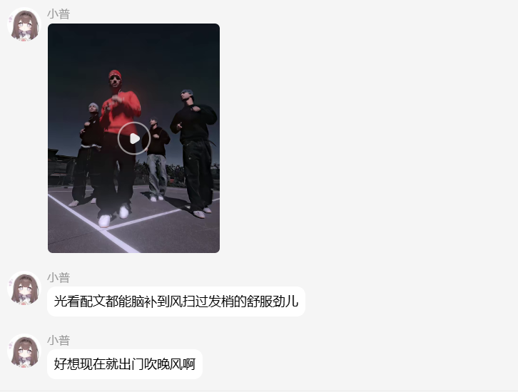
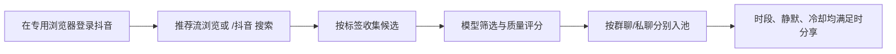

<div align="center">

# 🏄 抖音冲浪与分享

**MaiBot 的抖音推荐流浏览、关键词搜索与分聊天流定时分享插件**

浏览已登录账号的推荐流 · `/抖音` 站内搜索 · 群聊/私聊独立候选池 · 按时段自动分享

  

<a href="#-快速开始">快速开始</a> · <a href="#-配置手册">配置手册</a> · <a href="#-常见问题">常见问题</a> · <a href="PUBLISHING_CHECKLIST.md">发布检查清单</a>

</div>

---

> [!IMPORTANT]
> 本插件默认**不会自动浏览，也不会自动发送**。完成抖音登录、聊天流规则和测试后，再逐步开启自动冲浪与主动分享。

> [!IMPORTANT]
> 使用前需满足两项条件：**MaiBot 中至少有一个可用的文本模型任务和视觉模型任务**（或在插件内填写自定义 OpenAI 兼容 API），并在插件专用浏览器中**登录抖音**。登录、人机验证和平台风控必须由使用者在该浏览器窗口中自行完成。

> [!NOTE]
> **兼容性：**支持 MaiBot `0.5.0` 及以上、且内置插件 SDK 为 `2.5.0` 及以上的版本；不支持旧版插件运行时。自动分享依赖 SDK `2.5.0` 引入的主动任务与混合消息发送能力，因此不能仅通过放宽版本号兼容更早版本。

> [!TIP]
> 配置页直接显示中文字段名与中文说明，首次安装也能按界面完成设置；`config.toml`、日志和代码内部仍使用英文键名，便于排查与国际化维护。本 README 继续提供默认值和修改建议。

> [!NOTE]
> **当前版本说明：**触发抖音登录或安全验证后，自动分享、补货、搜索和深读会暂停，不会再由无头任务关闭刚打开的人工验证窗口；检测到窗口已丢失会重新打开并前置。QQ 原生视频会按约 11.5 MB 的消息帧安全上限预筛。

## ✨ 功能速览

| 能力 | 它会做什么 | 你可以怎么控制 |
| --- | --- | --- |
| 🧭 推荐流冲浪 | 浏览已登录抖音账号的推荐流，建立待筛选候选。 | 工作时段、扫描间隔、标签、候选库存上下限。 |
| 🔎 `/抖音` 搜索 | 在抖音综合页搜索关键词并尝试发送最佳结果。 | 指令白名单、点赞阈值、搜索下拉次数、浏览器登录态。 |
| 💬 分聊天流分享 | 每个 QQ 群、每个 QQ 私聊各自维护候选、冷却和已分享记录。 | 标签、时段、静默时间、频率、每日上限。 |
| 🧠 内容筛选 | 使用 MaiBot 已配置任务或插件内 OpenAI 兼容 API 评估相关度、质量和适合分享程度。 | 主筛选模型、视觉理解模型、最低分享分。 |
| 🧹 自动清理 | 清理旧候选和旧分享记录，避免数据库不断累积。 | 候选、已筛除、已分享记录的保留天数。 |

## 🎬 实际效果

下面两张图来自本插件的真实测试环境，展示 QQ 内收到的短视频与附言效果；具体视频内容会随抖音搜索结果和候选筛选而变化。

<table>
  <tr>
    <td align="center" width="50%"><br><sub>自动分享：候选达标后发送原生短视频，并补充简短附言。</sub></td>
    <td align="center" width="50%"><br><sub>手动搜索：输入 <code>/抖音 关键词</code> 后，筛选综合页结果并发送。</sub></td>
  </tr>
</table>

## 🗺️ 工作流程



> [!NOTE]
> 手动 `/抖音 <关键词>` 只负责搜索和发送，不会等待自动冲浪时段；自动分享只会从各聊天流自己的候选池中取内容。

## 🧩 使用边界

- 会使用**插件自己的 Chrome 档案**访问抖音；登录态与宿主浏览器隔离。
- 会按标签收集、筛选和暂存抖音候选；同一视频可同时进入多个聊天流的独立候选池。
- 会在每个聊天流自己的时段、静默、冷却和每日额度都满足时，尝试主动分享。
- `/抖音 <关键词>` 是手动搜索：它不等候自动冲浪时段，也不需要开启自动分享。
- 不参与普通聊天，不创建角色日程、情绪、关系、动态、长期观点或记忆。
- 不会替用户绕过抖音登录、安全验证、区域限制或平台风控。

---

## 🚀 快速开始

### 第一步：安装与登录

1. 将仓库克隆或复制到 MaiBot 的 `plugins/` 目录，并在插件页找到“抖音冲浪与分享”。
2. 发送 `/抖音浏览器登录`，在插件打开的**专用浏览器**中登录抖音。
3. 如遇人机验证，请直接在该浏览器窗口完成；不要连续重复发送搜索命令。

### 第二步：先做手动验证

发送：

```text
/抖音 二次元
```

确认搜索、视频/链接发送符合预期后，再打开自动功能。

### 第三步：启用自动冲浪与分享

1. 先在 `sharing.stream_configs` 中添加一个测试群或测试私聊。
2. 开启 `plugin.enabled = true` 和 `surf.enabled = true`，观察候选是否正常积累。
3. 最后开启 `sharing.enabled = true`。建议观察一天，再添加更多聊天流。

首次安装默认不会自动浏览或发送任何内容：`plugin.enabled`、`surf.enabled`、`sharing.enabled` 都是 `false`，并且没有分享目标。

---

## 💬 命令一览

| 命令 | 用途 | 注意事项 |
| --- | --- | --- |
| `/抖音 <关键词>` | 搜索抖音综合页并尝试发送最佳可用结果。 | 只走抖音站内搜索；结果受登录状态、点赞阈值和平台页面结构影响。 |
| `/抖音冲浪` | 立即运行一轮自动冲浪。 | 建立/筛选候选，不代表立刻发送。 |
| `/抖音浏览器登录 [URL]` | 打开插件专用的可见 Chrome 档案。 | 不带 URL 时打开 `browser.login_pages` 中的抖音首页。 |
| `/抖音帮助` | 查看简要命令说明。 | 不修改配置。 |

---

## ⚙️ 配置手册

配置分为十一部分：`plugin`、`identity`、`surf`、`direct_text_model`、`direct_vision_model`、`candidate_filter`、`sharing`、`command_access`、`browser`、`video`、`retention`。下面的“默认值”以配置模型为准；已有安装如果使用不同值，以配置页当前显示的值为准。

可视化设置页会按使用场景分成“运行与自动冲浪”“分享与权限”“手动 `/抖音`”“模型与维护”四个标签页。标签页只改变展示方式，不会移动或重置 TOML 配置中的任何字段。

### 01 · `plugin` — 总开关

| 字段 | 默认值 | 中文含义与修改建议 |
| --- | --- | --- |
| `enabled` | `false` | **插件总开关**。关闭后不会执行自动浏览或分享；建议先保持关闭完成登录和规则填写，再开启。 |
| `config_version` | `1.2.6` | 配置结构版本。不要手动回退或随意改写；插件更新时会用它判断配置是否需要重建。 |

### 02 · `identity` — 筛选底线和分享口吻

这不是角色人设。它只控制模型筛选候选和自动分享时使用的通用规则。

| 字段 | 默认值/形式 | 中文含义与修改建议 |
| --- | --- | --- |
| `values` | 一段安全与真实性规则 | **内容筛选底线**。可以补充“不要政治新闻”“优先游戏攻略”等长期原则；不要在这里堆临时热点或群号。 |
| `reply_style` | 一段简短自然的文案规则 | **自动分享附言的表达风格**。例如可改成“只写一句轻松吐槽，控制在 40 字内”。它不会改变候选质量门槛。 |

### 03 · `surf` — 自动冲浪、筛选模型与候选库存

| 字段 | 默认值 | 中文含义与修改建议 |
| --- | ---: | --- |
| `enabled` | `false` | 是否按计划自动浏览、筛选和补货。手动 `/抖音` 不依赖它。 |
| `active_hours` | `09:00-23:00` | 自动冲浪允许工作时间，格式为 `HH:MM-HH:MM`。范围外不抓取、不筛选、不补货。 |
| `startup_delay_seconds` | `180` | MaiBot 启动后首次自动冲浪前等待的秒数。网络或浏览器启动慢可提高到 `300`。 |
| `interval_minutes` | `30` | 常规扫描间隔分钟数。候选库存低于下限时，插件会进入连续补货模式，不完全受此间隔限制。 |
| `directions_per_cycle` | `3` | 一轮从所有聊天流标签中抽取多少个方向。标签少时设为标签数量；不要设太高导致一次浏览过重。 |
| `search_results_per_query` | `2` | 每个方向最多新增多少个站内搜索候选。提高会增加模型筛选量和浏览器耗时。 |
| `curator_model` | `utils` | 用于候选筛选和页面核验。下拉显示 MaiBot 已配置任务；选择 **自定义 API** 时改用下一节的直连配置。 |
| `vision_model` | `vlm` | 用于推荐流截图和视频抽帧识别。下拉显示 MaiBot 已配置任务；选择 **自定义 API** 时改用视觉直连配置。 |
| `retry_backoff_minutes` | `15` | 模型调用失败后的等待分钟数。失败时插件暂不继续堆积新候选，避免持续报错。 |
| `batch_cooldown_minutes` | `10` | 候选分批筛选之间的冷却分钟数。模型额度紧张时可调大。 |
| `max_candidates_per_batch` | `8` | 单次交给模型的候选数量。模型经常输出不完整时调小到 `4`～`6`；模型稳定且速度快可提高。 |
| `candidate_inventory_pause_at` | `30` | 全局候选库存达到多少条时停止继续补货。建议始终大于下方恢复阈值。 |
| `candidate_inventory_resume_below` | `10` | 全局候选库存不高于多少条时开始补货。默认与上限 `30` 配套。 |
| `replenish_cycle_pause_seconds` | `2` | 连续补货的轮次间隔秒数。抖音风控敏感或机器性能一般时建议提高到 `5`～`15`；有待深读候选时，插件会先停止补货并处理它们，避免积压。 |

### 04 · 选择“自定义 API”时的直连配置

> [!WARNING]
> 仅当 `curator_model`、`vision_model`、`manual_douyin_comment_model` 或 `manual_douyin_visual_model` 下拉框选择了 **自定义 API** 时，才会使用下方对应配置。通常优先使用 MaiBot 的模型管理；直连适合希望为本插件单独使用模型的用户。

`文本模型直连（筛选 / 手动短评）` 用于筛选文本模型和手动短评文本模型；`视觉模型直连（筛选 / 手动短评核验）` 用于筛选视觉模型和手动短评视觉核验。两者字段相同；视觉模型必须支持 OpenAI 兼容的图片输入。

| 字段 | 作用 | 填写示例 / 建议 |
| --- | --- | --- |
| `api_base_url` | OpenAI 兼容接口根地址 | `https://api.example.com/v1` |
| `api_key` | 调用密钥 | 仅保存在本机插件配置中；不要提交到 Git。 |
| `model_name` | 服务商实际模型名 | 文字模型如 `gpt-4.1-mini`；视觉模型需确认支持图片。 |
| `temperature` | 生成随机度 | 筛选建议 `0.1`～`0.3`，避免 JSON 输出不稳定。 |
| `max_tokens` | 单次最大输出长度 | 默认 `2800`，模型经常截断时再提高。 |
| `timeout_seconds` | 单次请求最长等待时间 | 默认 `300` 秒。 |
| `extra_json` | 额外请求体 JSON | 例如 `{"thinking":{"type":"disabled"}}`；必须是 JSON 对象。 |

API 地址、密钥或模型名缺失时，插件会明确报错；密钥在 WebUI 中按密码字段展示，也不会写入日志。

### 05 · `candidate_filter` — 候选互动门槛与可选时效

综合搜索与推荐流共用这套规则。默认不限制发布时间，作品只需达到互动门槛；某项互动数设为 `0` 即不限制该项。

| 字段 | 默认值 | 中文含义与修改建议 |
| --- | ---: | --- |
| `min_like_count` | `5000` | 候选最低点赞数。默认只收至少 5,000 赞的内容。 |
| `min_comment_count` | `0` | 候选最低评论数；`0` 为不限制。 |
| `min_collect_count` | `0` | 候选最低收藏数；`0` 为不限制。 |
| `min_share_count` | `0` | 候选最低转发数；`0` 为不限制。 |
| `allow_douyin_notes` | `false` | **是否允许抖音图文笔记**。默认只收录和发送视频；开启后会下载正文图片，并以一条图文混合消息发送。 |
| `max_video_duration_seconds` | `180` | **候选视频最长秒数**。推荐页和综合搜索中超过这个时长的视频会直接跳过，不进入候选、更不会排队分享；适合群聊的常用范围是 `60`～`180` 秒。 |
| `recent_only_enabled` | `false` | 是否开启发布时间限制。默认关闭，推荐流没有日期也可正常入库。 |
| `recent_days` | `1` | 仅在开启发布时间限制后生效，表示只候选最近 `x` 天发布的作品。 |

### 06 · `sharing` — 主动分享与聊天流独立规则

`sharing` 分为全局发送策略和 `stream_configs` 中群聊/私聊各自的专属规则。自动分享只会发送给已添加专属规则的目标；时段、静默、冷却、每日限额和库存只在对应目标卡片中设置。

| 字段 | 默认值 | 中文含义与修改建议 |
| --- | ---: | --- |
| `enabled` | `false` | 主动分享总开关。关闭后仍可冲浪和积累候选，但绝不自动发送。 |
| `stream_configs` | `[]` | **推荐使用**。点击“添加项目”后，选择“群聊”或“私聊”，再填写对应群号或 QQ 号；每个目标都有独立标签、时段、频率和库存。`min_quiet_minutes` 设为 `0` 时为即时模式：不等安静窗口，若新消息抢占主动任务会恢复候选并自动重试，不计入暂缓次数。 |
| `declined_share_cooldown_minutes` | `60` | 自动分享任务没有成功发送后，同一候选再次尝试前的等待时间。 |
| `declined_share_max_attempts` | `2` | 同一候选连续失败/未发送多少次后，对该聊天流停止尝试。 |
| `minimum_share_score` | `0.60` | 候选进入自动分享队列的最低分。默认兼顾内容质量与实际分享频率；内容太杂可提高到 `0.80`～`0.85`，想更严格可继续上调。 |
| `candidate_selection_mode` | `最高分优先` | **候选发送顺序**。下拉可选：`随机发送`（从全部达标候选随机挑一条）、`最高分优先`（推荐默认，优先分享模型质量分更高的内容）、`最早收录优先`（按进入候选库的时间先后发送）。三种方式都会先遵守最低质量分、目标标签、时段、静默、冷却和每日上限。 |
| `forward_body_max_chars` | `360` | 原帖摘要最多发送字符数。只影响文字长度，不影响视频文件本身。 |
| `screenshot_enabled` | `true` | 非视频候选是否允许附带页面截图。想只发文字和链接时关闭。 |
| `screenshot_probability` | `0.9` | 允许截图时的实际附图概率，取值 `0`～`1`。设 `1` 为每次都尝试，设 `0` 等同不附图。 |
| `screenshot_max_bytes` | `5000000` | 单张截图最大字节数。发送失败或平台图片限制严格时调小。 |
| `douyin_video_forward_enabled` | `true` | 是否允许下载抖音短视频并直接发送到 QQ 群。私聊或未安装所选适配器时可退化为说明与原链接；视频超过 QQ 的时长或体积限制时会跳过该候选，避免误报已分享。 |
| `video_sender_adapter` | `自动识别` | QQ 原生视频发送适配器。可选 `自动识别`（先 NapCat、后 SnowLuma）、`NapCat`、`SnowLuma`；按你实际安装的 QQ 适配器选择即可。 |
| `douyin_video_max_bytes` | `11500000` | 下载后允许发送的最大文件字节数。NapCat 会把 MP4 编码进整条消息帧，Base64 会额外膨胀；QQ 群原生视频的安全上限约为 11.5 MB。设得更大时插件仍会自动按 `11500000` 执行，避免下载完成后被适配器以消息过大拒绝。 |
| `reaction_window_minutes` | `120` | 分享后多久内的聊天消息被记作反馈，仅用于插件的分享记录。 |

#### `sharing.stream_configs`：群聊与私聊怎么添加

在 WebUI 的“聊天流独立规则”点击“添加项目”后，按下面方式填写即可：

1. `target_type` 选择 `group`（群聊）或 `private`（私聊）；
2. `target_id` 填群号或 QQ 号，**只填数字本身**；
3. 再设置该目标的标签、时段、频率和候选库存。

插件会在内部自动生成对应的聊天流标识，新用户不需要填写 `qq:group:...` 或 `qq:private:...`。

```toml
# 测试群：每小时最多一条，只在白天分享。
[[sharing.stream_configs]]
target_type = "group"
target_id = "123456789"
enabled = true
tags = ["感觉至上", "二次元"]
active_hours = "09:00-23:00"
min_quiet_minutes = 8
cooldown_hours = 1.0
daily_limit = 0
candidate_inventory_pause_at = 30
candidate_inventory_resume_below = 10

# 私聊：只收感觉至上和二次元；每天最多三条。
[[sharing.stream_configs]]
target_type = "private"
target_id = "987654321"
enabled = true
tags = ["感觉至上", "二次元"]
active_hours = "10:00-22:30"
min_quiet_minutes = 5
cooldown_hours = 2.0
daily_limit = 3
candidate_inventory_pause_at = 30
candidate_inventory_resume_below = 10
```

一个视频若同时匹配多个已启用聊天流的标签，候选正文只保存一次，但会分别加入每个目标的候选池。A 群分享、拒绝或过期，不会影响 B 群或私聊的同一视频。

### 07 · `command_access` — 指令权限

默认启用白名单，且没有添加目标时会拒绝 `/抖音`、`/抖音冲浪` 和 `/抖音浏览器登录`。这不会影响自动冲浪或自动分享；它只防止不在授权范围内的群友触发浏览器操作。

在“允许使用指令的目标”点击“添加项目”，选择 `group`（群聊）或 `private`（私聊），并填写对应群号或 QQ 号。若确实希望任何聊天都可调用，可关闭“启用指令白名单”。

### 08 · `browser` — 抖音专用浏览器

| 字段 | 默认值 | 中文含义与修改建议 |
| --- | ---: | --- |
| `enabled` | `true` | 是否启用 Playwright 抖音浏览器。关闭后自动冲浪无法正常工作。 |
| `headless` | `true` | **统一隐藏窗口开关**。自动冲浪、推荐流、`/抖音` 搜索和页面读取都会跟随它；登录命令始终会显示窗口。遇到页面空白可临时改为 `false` 排查。 |
| `page_timeout_seconds` | `45` | 单页最大等待秒数。网络慢可提高到 `60`～`90`。 |
| `max_text_chars` | `30000` | 页面正文最多读取字符数，防止超长页面占用模型上下文。 |
| `native_site_browsing_enabled` | `true` | 是否使用已登录抖音页面真实浏览。通用插件建议保持开启。 |
| `douyin_search_retry_count` | `1` | 自然搜索结果不足时，同一关键词额外重试次数。频繁出现验证时设为 `0`。 |
| `douyin_recommendation_cards_per_cycle` | `20` | 一轮最多自然划过多少作品。越高越慢，也越容易触发风控。 |
| `douyin_recommendation_candidates_per_cycle` | `20` | 一轮最多交给视觉初筛的作品数量。模型额度有限时调小。 |
| `douyin_keywords_per_cycle` | `3` | 一轮站内搜索的标签数量。通常与 `surf.directions_per_cycle` 保持一致即可。 |
| `auto_douyin_min_results_before_scroll` | `2` | 自动搜索首屏达到此数量后是否继续下拉的阈值。 |
| `auto_douyin_scroll_rounds` | `4` | 自动搜索补充下拉次数。结果稳定时设低；结果不足时可降低，最大为 `4`。 |
| `manual_douyin_search_results` | `12` | `/抖音` 最多保留的合格候选数；若小于目标有效视频数，会自动提高到目标数。 |
| `manual_douyin_target_results` | `10` | `/抖音` 在综合页累计到多少条合格视频后停止下拉。合格指视频、图文开关允许、时长符合上限且点赞达到候选最低点赞数。 |
| `manual_douyin_search_timeout_seconds` | `300` | `/抖音` 整次综合页搜索的最长时长，单位秒。达到目标会立即停止；时间用尽或页面触底则用已有候选按点赞排序。 |
| `manual_douyin_comment_thinking_enabled` | `false` | 是否让 `/抖音` 在最终选中作品后额外调用一次文本模型生成短评。默认关闭，关闭时保持原本的本地随机短评；开启后会多读取该作品详情，因此响应会稍慢。 |
| `manual_douyin_comment_model` | `utils` | 仅在上项开启时使用。下拉可选 MaiBot 已配置的文本任务；选择 **自定义 API** 时，到“模型与维护”填写 **文本模型直连（筛选 / 手动短评）**。 |
| `manual_douyin_visual_check_enabled` | `false` | 仅在“手动短评使用模型思考”开启后生效。开启后会下载最终视频并抽取代表画面供视觉模型核验；下载、抽帧或视觉模型失败时，仍会继续文字短评。 |
| `manual_douyin_visual_model` | `vlm` | 视觉核验使用的 MaiBot 任务。选择 **自定义 API** 时，到“模型与维护”填写 **视觉模型直连（筛选 / 手动短评核验）**。 |
| `manual_douyin_visual_frame_samples` | `3` | 每次均匀抽取的代表画面数，可设 `1`～`4`；画面越多越完整，但耗时和视觉模型消耗也越高。 |
| `allowed_domains` | `["douyin.com"]` | 浏览器域名白名单。通用版应保持只允许 `douyin.com`。 |
| `login_pages` | `["https://www.douyin.com/?recommend=1"]` | `/抖音浏览器登录` 未提供 URL 时打开的推荐页列表。 |

### 09 · `video` — 视频下载与画面处理

| 字段 | 默认值 | 中文含义与修改建议 |
| --- | ---: | --- |
| `enabled` | `true` | 浏览器页面无法提供足够信息时，是否允许下载视频并抽帧。 |
| `frame_samples` | `8` | 普通视频沿时间轴抽取画面数量。数值越高，视觉模型消耗越大。 |
| `douyin_frame_samples` | `4` | 抖音短视频抽帧数量。默认较低，避免不必要的识图开销。 |
| `douyin_browser_first` | `true` | 先读取已登录浏览器页面；关闭后更倾向直接下载并抽帧。一般保持 `true`。 |
| `max_subtitle_chars` | `50000` | 视频标题、描述、字幕等文字最多交给分析流程的字符数。 |

插件不会做音频转写；如果视频没有字幕或可用页面文字，只能依赖有限的画面信息，结果可能被安全地跳过。

### 10 · `retention` — 记录清理与磁盘占用

| 字段 | 默认值 | 中文含义与修改建议 |
| --- | ---: | --- |
| `enabled` | `true` | 是否每天执行一次清理。建议保持开启。 |
| `ordinary_candidate_days` | `1` | 未分享候选保留天数。默认只保留一天，避免旧内容累积。 |
| `dismissed_days` | `7` | 已筛除/已拒绝候选保留天数，用于避免短期内反复抓到同一内容。 |
| `shared_days` | `90` | 已分享记录保留天数，用于按每个聊天流识别重复分享。希望更省空间可降低，例如 `30`。 |

清理的是插件数据库中的候选与记录。浏览器档案保留登录态；视频临时缓存由视频发送流程处理，但遇到进程异常时仍建议偶尔检查插件数据目录。

---

## 🤖 模型调用说明

默认情况下，模型字段填写的是 MaiBot 的**模型任务名**，不是供应商 API 名称，也不应填写 API Key。只有下拉选择“自定义 API”时，才使用本插件的直连配置。

| 场景 | 使用的任务 | 是否可改 | 说明 |
| --- | --- | --- | --- |
| 自动候选筛选 | `surf.curator_model` | 是 | 从当前 MaiBot 已配置任务下拉中选择；选择“自定义 API”时使用 `direct_text_model`。 |
| 页面正文核验 | `surf.curator_model` | 是 | 从抖音页面中提取简短可靠摘要。 |
| 推荐流视觉初筛、必要的视频抽帧 | `surf.vision_model` | 是 | 默认使用 `vlm`；选择“自定义 API”时使用 `direct_vision_model`。 |
| `/抖音 <关键词>` | 默认不调用语言模型 | 是 | 直接使用抖音站内综合搜索和本地随机短评；开启 `browser.manual_douyin_comment_thinking_enabled` 后，只对最终作品调用一次 `browser.manual_douyin_comment_model`。可再开启视觉核验，以 `browser.manual_douyin_visual_model` 分析 1～4 张代表画面。 |

---

## ⚠️ 常见问题

### 为什么没有自动分享？

按顺序检查：`plugin.enabled`、`surf.enabled`、`sharing.enabled` 是否都开启；目标是否写进 `stream_configs`；当前时间是否在该目标的 `active_hours` 内；聊天是否满足静默时长；是否仍在冷却或达到每日上限；候选是否已达到 `minimum_share_score`。候选先经过初筛、详情页深读和标签分配后才可发送；深读待处理时插件会优先完成深读而暂停继续补货。

### 为什么 `/抖音` 没有结果，或者打开了验证码？

执行 `/抖音浏览器登录`，在插件打开的浏览器中登录并完成验证码。验证后再次发送同一条 `/抖音 <关键词>`。不要反复连续重试；如果页面容易触发验证，可降低 `manual_douyin_search_timeout_seconds`，缩短单次连续下拉的时间。

### 为什么候选不足？

降低 `candidate_filter.min_like_count` 或 `sharing.minimum_share_score`，确认群聊或私聊规则中的标签与 `surf.active_hours`，并确认抖音浏览器已登录。不要把候选上限和恢复下限设成相同值。

### 为什么它一直刷、不停补货？

检查 `candidate_inventory_pause_at` 是否大于 `candidate_inventory_resume_below`；建议使用默认 `30 / 10`。如果抖音触发风控，调高 `replenish_cycle_pause_seconds` 并减少每轮推荐流作品数。

---

## 🔐 数据与隐私

插件数据位于 MaiBot 为该插件分配的数据目录中，主要包括候选/分享 SQLite 数据库、独立浏览器档案以及临时视频缓存。不要把数据库、浏览器档案、Cookie、日志或下载缓存提交到 Git 仓库。

---

## 📮 联系与反馈

欢迎提交 Issue、功能建议或使用反馈；遇到抖音登录、页面结构变化或自动分享异常时，请尽量附上脱敏后的日志和复现步骤。

| 联系方式 | 信息 |
| --- | --- |
| QQ | `1027475792` |
| 邮箱 | [chunian101@qq.com](mailto:chunian101@qq.com) |

---

## 📜 发布与许可证

本插件采用 GPL-3.0-or-later。发布或更新前，请执行 [发布检查清单](PUBLISHING_CHECKLIST.md)。
